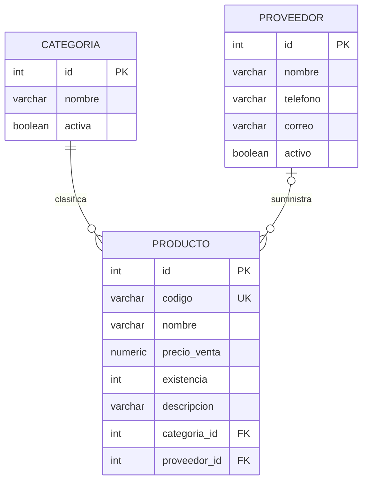

# Persistencia y relaciones con Spring Data JPA
Asignatura: Servicios Web · Unidad II · Ingeniería en Sistemas de Información

## Configuración
La aplicación conecta a PostgreSQL local, base `gestion_productos`, puerto 5432 y usuario `postgres`.
La contraseña permanece en la configuración local y se omite en este documento.
```properties
spring.application.name=gestion-productos
spring.datasource.url=jdbc:postgresql://localhost:5432/gestion_productos
spring.datasource.username=postgres
spring.datasource.password=<contraseña local>
spring.jpa.hibernate.ddl-auto=validate
spring.jpa.show-sql=true
spring.jpa.properties.hibernate.format_sql=true
spring.flyway.enabled=true
```
`validate` comprueba la correspondencia entre las entidades y el esquema al iniciar.
No crea ni modifica tablas; Flyway gestiona los cambios mediante migraciones versionadas.

## Estructura de paquetes
```text
ni.edu.uam.gestionproductos
├── GestionProductosApplication
├── entity
│   ├── Categoria
│   ├── Producto
│   └── Proveedor
├── repository
│   ├── CategoriaRepository
│   ├── ProductoRepository
│   └── ProveedorRepository
└── controller
    ├── CategoriaController
    ├── ProductoController
    ├── ProveedorController
    └── ApiExceptionHandler
```

## Entidades y relaciones
Categoria contiene id, nombre y activa.
Producto contiene id, codigo, nombre, precioVenta (BigDecimal), existencia, descripcion, categoria y proveedor.
Proveedor contiene id, nombre, telefono, correo y activo.
Todos los identificadores usan Integer y GenerationType.IDENTITY, coherentes con SERIAL.
Los campos de texto tienen límites acordes con las columnas; precio y existencia no admiten valores negativos.



Cada producto tiene una categoría y puede tener un proveedor.
Un proveedor puede suministrar muchos productos. La columna proveedor_id acepta NULL
para conservar los productos anteriores a V3 y permitir el ejemplo inicial de la guía.
Las relaciones son unidireccionales: el JSON incluye categoría y proveedor dentro del producto, sin ciclos.

## Migraciones
Los scripts completos se adjuntan en `src/main/resources/db/migration`:
- V1__crear_tablas.sql: crea categoria y producto con su clave foránea.
- V2__agregar_descripcion_producto.sql: añade descripcion VARCHAR(500).
- V3__crear_proveedor_y_relacion.sql: crea proveedor, añade proveedor_id y su clave foránea e índices.

V1 se conservó sin cambios. Flyway registra versión, checksum y resultado en flyway_schema_history.

## Pruebas y evidencias
`mvnw.cmd test` pasó cinco pruebas sin errores: arranque, creación y consulta con relaciones,
rechazo de datos inválidos, categoría inexistente y creación de categorías/proveedores.
Las pruebas usan la base PostgreSQL real y transacciones con rollback para los datos de prueba.

La colección importable está en `postman/gestion-productos.postman_collection.json`.
Ejecutar las solicitudes en orden; los IDs se capturan sin asumir que comienzan en 1.

Se verificó además la API por HTTP en el puerto 8081 y se cargaron tres categorías,
dos proveedores y los productos LAP-001 y MOU-001. Las tres consultas GET respondieron 200.
Las respuestas reales están en `docs/evidencias/categorias.json`,
`docs/evidencias/proveedores.json` y `docs/evidencias/productos.json`.
La consulta directa de PostgreSQL en `docs/evidencias/postgresql.txt` confirma
V1, V2 y V3 exitosas y los productos asociados a sus categorías y proveedores.

### Capturas pendientes para la entrega académica
Las comprobaciones automatizadas no son capturas de Postman. Adjuntar capturas reales de:
1. POST de categoría y su respuesta 201.
2. GET de las tres categorías.
3. POST de cada proveedor y GET de proveedores.
4. POST de producto con categoria.id y proveedor.id.
5. GET de productos mostrando ambas relaciones y descripcion.
6. PostgreSQL: tablas, claves foráneas y flyway_schema_history con V1, V2 y V3 exitosas.

Consultas para reproducir la evidencia:
```sql
SELECT version, description, success
FROM flyway_schema_history ORDER BY installed_rank;

SELECT p.codigo, p.nombre, c.nombre AS categoria, pr.nombre AS proveedor
FROM producto p
JOIN categoria c ON c.id = p.categoria_id
LEFT JOIN proveedor pr ON pr.id = p.proveedor_id;
```

## Respuestas de comprobación
1. **Spring Data JPA:** simplifica el acceso a datos con repositorios que generan implementaciones de operaciones comunes sobre entidades JPA.
2. **Hibernate:** implementa JPA, mapea objetos a tablas, genera SQL y gestiona el estado de las entidades.
3. **JPA e Hibernate:** JPA es la especificación de persistencia; Hibernate es una implementación concreta.
4. **@Entity:** identifica una clase como entidad persistente administrada por JPA.
5. **@ManyToOne:** declara que muchos registros de la entidad actual pueden referenciar el mismo registro de otra entidad, como varios productos de una categoría.
6. **@JoinColumn:** especifica la columna de unión que contiene la clave foránea, por ejemplo categoria_id.
7. **JpaRepository:** proporciona métodos como findAll, findById, save, deleteById, existsById y count, además de paginación, ordenación y operaciones de persistencia JPA.
8. **Migraciones:** permiten reproducir y versionar cambios del esquema, manteniendo un historial de su aplicación.
9. **V1, V2 y V3:** son versiones consecutivas: estructura inicial; descripción del producto; proveedores y su relación. Los cambios nuevos se agregan como nuevas versiones.
10. **Relación bidireccional y JSON:** puede causar recursión infinita al serializar categoría → productos → categoría. Puede evitarse mediante DTOs o controlando la serialización de uno de los lados. Este proyecto usa relaciones unidireccionales.

## Conclusión
Se implementó una API REST que persiste categorías, productos y proveedores en PostgreSQL.  
Spring Data JPA redujo el código necesario para las operaciones de acceso a datos.  
Hibernate realizó el mapeo entre entidades Java y tablas relacionales.  
Las relaciones ManyToOne vincularon cada producto con sus registros relacionados.  
Flyway permitió evolucionar el esquema mediante tres migraciones ordenadas.  
Las pruebas verificaron persistencia, respuestas HTTP y validación de datos.  
La colección de Postman permite reproducir el flujo y completar las evidencias visuales.

